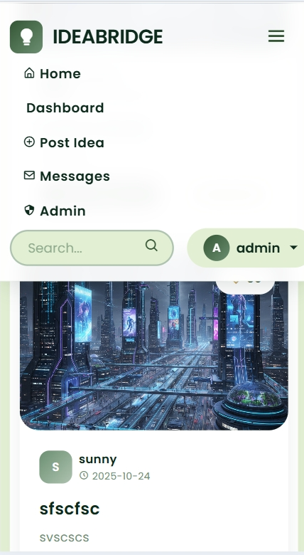

# IdeaBridge

[](https://ideabridge.onrender.com/)
[](https://www.python.org/)
[](https://flask.palletsprojects.com/)
[](https://www.sqlite.org/)

A modern, interactive platform for sharing and discovering innovative ideas. Built with Flask, featuring a responsive design and smooth animations.

## 🚀 Live Demo

Visit the live application: **[https://ideabridge.onrender.com/](https://ideabridge.onrender.com/)**

## ✨ Features

### Core Functionality
- **Idea Management**: Create, read, update, and delete ideas
- **User Authentication**: Secure login and registration system
- **Responsive Design**: Optimized for all devices
- **Interactive UI**: Modern animations and smooth transitions
- **Database Integration**: SQLite database for data persistence

### Technical Features
- **Flask Web Framework**: Lightweight and scalable Python backend
- **SQLAlchemy ORM**: Database abstraction and management
- **Bootstrap 5**: Modern responsive CSS framework
- **AOS Animations**: Animate on scroll effects
- **Custom Cursor**: Interactive cursor with hover effects
- **Particle.js Integration**: Dynamic background animations
- **Form Validation**: Client and server-side validation
- **Error Handling**: Comprehensive error pages and messages

### User Experience
- **Smooth Scrolling**: Enhanced navigation experience
- **Loading Animations**: Professional preloader
- **Mobile Menu**: Responsive navigation for mobile devices
- **Scroll Progress**: Visual progress indicator
- **Back to Top**: Quick navigation button
## 📸 Screenshots

### Application Interface

*Main dashboard showing featured ideas and modern UI design*


*Idea creation and management interface with form validation*


*Login and registration forms with responsive design*

### Mobile Responsiveness

*Mobile-optimized interface showcasing responsive design*


*Collapsible navigation menu for mobile devices*

### Interactive Features

*Smooth animations and transitions powered by AOS library*


*Interactive custom cursor with hover effects*

> **Note**: To add actual screenshots to this README:
> 1. Take screenshots of your running application
> 2. Save them in the `docs/images/screenshots/` directory
> 3. Update the image filenames in the sections above
> 4. Commit and push the changes to see them in GitHub

## 🏗️ Architecture

### System Architecture

*High-level system architecture showing Flask backend, SQLite database, and frontend components*

### Technology Stack

*Complete technology stack visualization*

## 🛠️ Tech Stack

- **Backend**: Python, Flask
- **Database**: SQLite
- **Frontend**: HTML5, CSS3, JavaScript
- **Framework**: Bootstrap 5
- **Animations**: AOS (Animate On Scroll), Particle.js
- **Icons**: Font Awesome
- **Deployment**: Render

## 📋 Prerequisites

- Python 3.8 or higher
- pip (Python package manager)
- Git (for version control)

## 🚀 Installation

1. **Clone the repository**
   ```bash
   git clone https://github.com/navadeep0508/IdeaBridge.git
   cd IdeaBridge
   ```

2. **Create virtual environment**
   ```bash
   python -m venv venv
   source venv/bin/activate  # On Windows: venv\Scripts\activate
   ```

3. **Install dependencies**
   ```bash
   pip install -r requirements.txt
   ```

4. **Initialize the database**
   ```bash
   python init_db.py
   ```

5. **Run the application**
   ```bash
   python app.py
   ```

6. **Open your browser**
   Navigate to `http://localhost:5000`

## 📁 Project Structure

```
IdeaBridge/
├── app.py                 # Main Flask application
├── init_db.py            # Database initialization
├── migrate_db.py         # Database migration script
├── requirements.txt      # Python dependencies
├── data.db              # SQLite database
├── docs/                # Documentation and images
│   └── images/
│       ├── screenshots/ # Application screenshots
│       └── diagrams/    # Architecture and flow diagrams
├── static/              # Static files (CSS, JS, images)
│   ├── css/
│   ├── js/
│   └── images/
├── templates/           # HTML templates
│   ├── base.html
│   ├── index.html
│   └── ...
├── script.js            # Frontend JavaScript
├── style.css            # Custom CSS styles
└── README.md           # Project documentation
```

## 🔧 Configuration

The application uses the following default configuration:

- **Host**: `0.0.0.0`
- **Port**: `5000`
- **Debug**: `True` (development)
- **Database**: `data.db` (SQLite)

For production deployment, update the configuration in `app.py`:

```python
app.config['SECRET_KEY'] = 'your-secret-key-here'
```

## 🚀 Deployment

### Render Deployment

The application is configured for deployment on Render with the following settings:

1. **Runtime**: Python 3
2. **Build Command**: `pip install -r requirements.txt`
3. **Start Command**: `python app.py`

### Environment Variables

For production deployment, set the following environment variables:

- `FLASK_ENV`: `production`
- `SECRET_KEY`: Your secret key
- `DATABASE_URL`: Database connection string (if using external DB)

## 📖 Usage

1. **Home Page**: Browse featured ideas and recent submissions
2. **Registration**: Create a new account to start posting ideas
3. **Login**: Access your account to manage your ideas
4. **Submit Ideas**: Share your innovative concepts with the community
5. **View Ideas**: Explore and interact with ideas from other users

## 🎨 Customization

### Styling
- Modify `static/css/style.css` for custom styling
- Update Bootstrap variables in `templates/base.html`
- Customize animations in `script.js`

### Functionality
- Add new routes in `app.py`
- Create new templates in `templates/` directory
- Extend database models in `app.py`

## 🤝 Contributing

1. Fork the repository
2. Create a feature branch (`git checkout -b feature/amazing-feature`)
3. Commit your changes (`git commit -m 'Add amazing feature'`)
4. Push to the branch (`git push origin feature/amazing-feature`)
5. Open a Pull Request

## 📄 License

This project is licensed under the MIT License - see the [LICENSE](LICENSE) file for details.

## 🙏 Acknowledgments

- [Flask](https://flask.palletsprojects.com/) - Web framework
- [Bootstrap](https://getbootstrap.com/) - CSS framework
- [AOS](https://michalsnik.github.io/aos/) - Animation library
- [Particle.js](https://vincentgarreau.com/particles.js/) - Particle effects
- [Render](https://render.com/) - Deployment platform

## 📞 Support

For support and questions:
- Create an issue in this repository
- Contact: [navadeep0508@gmail.com]

---

**Made with ❤️ by Navadeep**
